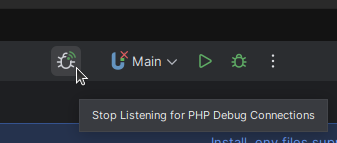
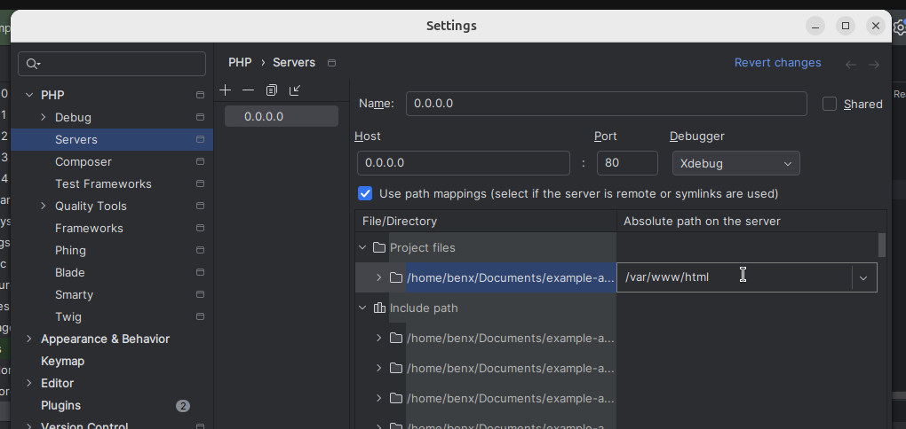

### Setting Up Xdebug in Laravel with Sail

Setting up a debugger with Laravel Sail is incredibly straightforward, thanks to the thoughtful setup provided by the Laravel team. Follow these steps to get Xdebug up and running:

---

### 1. Update Your `.env` File
Add the following environment variable to your project's `.env` file:

```plaintext
SAIL_XDEBUG_MODE=develop,debug
```

After updating the file, restart Sail to apply the changes:

```bash
./vendor/bin/sail down
./vendor/bin/sail up -d
```

---

### 2. Enable Debugging in PhpStorm
1. In PhpStorm, click on **"Start Listening for PHP Debug Connections"**.
   
   

3. Optionally, enable **"Break at first line in PHP scripts"** for easier debugging.
   
   

---

### 3. Install the Xdebug Helper Browser Extension
The Xdebug Helper extension simplifies enabling and disabling debugging in your browser. Install the extension for your preferred browser using the links below:

- [Firefox](https://addons.mozilla.org/en-GB/firefox/addon/xdebug-helper-for-firefox/)  
- [Chrome](https://chromewebstore.google.com/detail/xdebug-helper/eadndfjplgieldjbigjakmdgkmoaaaoc)  
- [Edge](https://microsoftedge.microsoft.com/addons/detail/xdebug-helper/ggnngifabofaddiejjeagbaebkejomen)  

Once installed, activate the debugger in the extension as shown below:  


---

### 4. Verify the Debugger Connection
Refresh your Laravel application in the browser. PhpStorm should prompt you to accept an incoming Xdebug connection:


Click **"Accept"**. At this point, the debugger will stop at the first line of your Laravel application, confirming that everything is working! 🚀

---

### 5. Configure Path Mapping in PhpStorm
Before proceeding, stop the current debugging session by clicking the red stop button in the bottom-left corner of the PhpStorm debugger toolbar.

#### Automatic PHP Server Configuration
When you accepted the incoming connection, PhpStorm automatically created a PHP server named `0.0.0.0`. However, since Sail uses Docker, you need to configure **path mappings** to ensure PhpStorm correctly maps files between your local environment and the Docker container.

#### Setting Up Path Mappings
1. Open PhpStorm settings:  
   - Use the shortcut **Ctrl + Alt + S**, or  
   - Navigate to **File > Settings**.

2. Go to **PHP > Servers**.

3. Select the server named `0.0.0.0` (created earlier).  

4. Add the following path mapping:  
   - **Local path:** (your project's root directory)  
   - **Server path:** `/var/www/html`  

   Your configuration should look similar to the screenshot below:  
   

---

### 6. Debug with Breakpoints
Now that everything is configured:
- Disable **"Break at first line in PHP scripts"** for smoother debugging.  
- Add breakpoints anywhere in your project.  

When you refresh your Laravel application, the debugger will stop at your breakpoints as expected.
